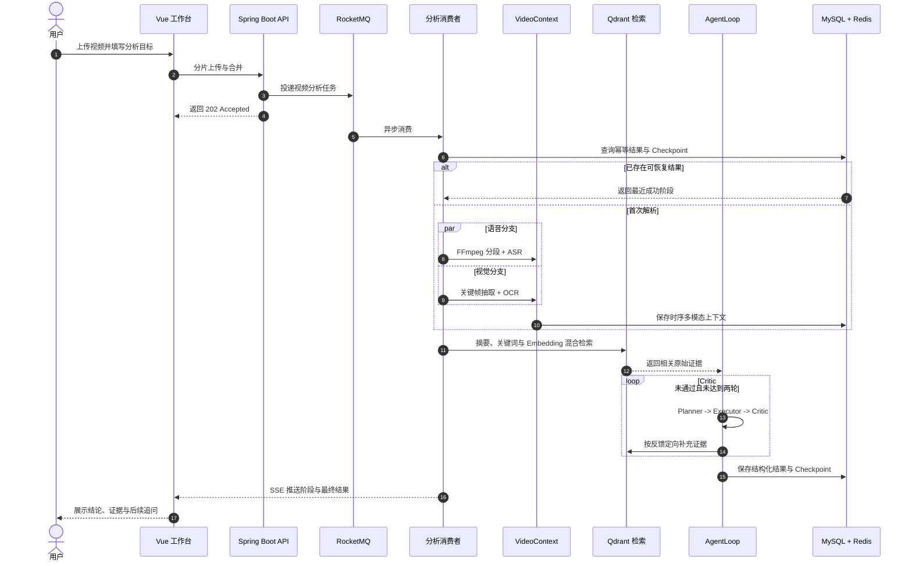

# VidMind-AI — 长视频内容理解 Video Agent

<div align="center">
  <p>
    <a href="https://github.com/xing05188/VidMind-AI/stargazers"></a>
    
    
    
    
    
    
    
    
    <a href="./LICENSE"></a>
  </p>
</div>

<div align="center">

面向长视频内容理解的 <strong>Video Agent</strong>。

VidMind-AI 将长视频转化为可检索、可追溯、可继续追问的结构化知识。

系统融合 ASR 与关键帧 OCR 构建多模态 <code>VideoContext</code>，再由 Planner、Executor 与 Critic 围绕用户目标完成分析和证据校验。

</div>

---

## 目录

- [项目预览](#项目预览)
- [核心功能](#核心功能)
- [系统流程](#系统流程)
- [技术栈](#技术栈)
- [快速开始](#快速开始)
- [项目结构](#项目结构)
- [常见问题](#常见问题)
- [贡献指南](#贡献指南)
- [License](#license)

---

## 项目预览

> VidMind-AI 提供完整的 Web 工作台，覆盖从登录注册、视频上传到 Agent 分析结果展示的全流程体验。

| 功能 | 截图 |
|:---|:---:|
| **登录与注册** |  |
| **视频工作台** |  |
| **Agent 目标输入** |  |
| **Agent 分析结果** |  |

用户完成登录后，可以上传视频并在工作台管理解析任务；选择视频并输入分析目标后，Agent 会展示结构化结论、时间戳证据、执行计划、阶段轨迹与质量评估，并支持基于同一视频继续追问。

## 核心功能

### 可靠的视频任务链路

- **分片上传**：前端按 5MB 分片上传，Redis 记录已完成分片，MinIO 保存合并后的视频。
- **异步解耦**：RocketMQ 将视频解析移出请求线程，Redisson 按"内容指纹 + 分析目标"控制并发与重复消费。
- **限流与重试**：用户级和全局令牌桶限制 AI 请求速率；ASR 与模型调用采用有限次数的指数退避重试。

### 时序多模态 VideoContext

- **多模态抽取**：FFmpeg 将音频按 60 秒切片，同时通过场景变化检测抽取关键帧，并以 30 秒保底采样避免遗漏静态板书。
- **并行处理**：ASR 与 OCR 使用独立有界线程池并行执行；相邻画面通过感知哈希去重，单路失败时保留另一条有效信息。
- **统一表示**：语音区间、OCR 文本、关键帧与时间戳被合并为统一的 `VideoSegment`，后续检索和校验不再依赖底层模型格式。

```text
[02:00 - 03:00]  VideoSegment
├── ASR      接下来讲解二叉树的前序遍历
├── OCR      前序遍历：根节点、左子树、右子树
└── Evidence frame_000125.jpg
```

### 有证据约束的 AgentLoop

- **Planner**：将用户目标拆解为可执行子任务，生成执行计划。
- **Executor**：按计划执行，生成结构化结论、时间戳证据和建议。
- **Critic**：校验目标覆盖、结构完整性与时间戳证据；不通过时根据缺失内容和时间范围重新检索。
- **轮次控制**：AgentLoop 最多执行两轮，既允许定向修正，也通过轮次上限控制延迟和 Token 成本。

### 长视频检索与断点恢复

- **混合检索**：每 5 分钟生成片段摘要、关键词和 Embedding，通过关键词匹配与 Qdrant 语义召回选择 TopK 原始证据。
- **优雅降级**：Qdrant 或 Embedding 服务不可用时退化到本地关键词与已有向量排序，不阻断主分析链路。
- **断点恢复**：Checkpoint 以 MySQL 为恢复真源、Redis 为热缓存，持久化 `VideoContext`、分块、计划、Critic 状态和最终结果。
- **失败重投**：前端通过 SSE 接收任务阶段；失败消息写入独立失败主题与失败任务表，可由管理接口重新投递。

## 系统流程

以下时序图展示了从视频上传到分析结果呈现的完整数据流：



## 技术栈

| 层次 | 技术 | 用途 |
| :--- | :--- | :--- |
| Web | Vue 3、Vite、SSE、Marked | 上传、Agent 工作台、实时进度与安全 Markdown 展示 |
| API | Java 21、Spring Boot 3.5.9、Undertow、MyBatis-Plus | 鉴权、媒体管理、任务编排与 REST API |
| 异步与缓存 | RocketMQ 4.9.4、Redis 7.4、Redisson | 异步削峰、状态缓存、限流、锁与消费幂等 |
| 数据与存储 | MySQL 8、MinIO、Qdrant | 业务数据、视频对象、Checkpoint 与向量检索 |
| 视频与 AI | FFmpeg、Tesseract、LangChain4j、DeepSeek、TeleSpeechASR、BGE-M3 | 音视频处理、多模态解析、Agent 推理与 Embedding |
| 部署 | Docker Compose | 本地中间件编排 |

## 快速开始

### 环境要求

| 组件 | 要求 | 说明 |
| :--- | :--- | :--- |
| JDK | 21 | 后端运行环境 |
| Node.js | 22 | Vue 与 Vite 构建环境 |
| Docker | 支持 Compose | 启动 MySQL、Redis、MinIO、Qdrant 与 RocketMQ |
| FFmpeg | 可在终端调用 | 音频切分与关键帧抽取 |
| Tesseract | 安装 `chi_sim` 与 `eng` 语言包 | 中英文关键帧 OCR |
| yt-dlp | 可选 | 仅解析在线视频链接时需要 |

> **提示**：所有组件安装完成后，请确保 `ffmpeg` 和 `tesseract` 可在终端中直接调用。

### 1. 准备配置

```bash
cp .env.example .env
```

编辑 `.env` 文件，至少设置以下参数：

- 数据库密码 `MYSQL_ROOT_PASSWORD`
- Redis 密码 `REDIS_PASSWORD`
- MinIO 用户名与密码 `MINIO_ROOT_USER` / `MINIO_ROOT_PASSWORD`
- API 密钥 `SILICONFLOW_API_KEY`

> **注意**：`.env` 文件包含敏感信息，已加入 `.gitignore`，请勿提交到版本控制。

### 2. 启动中间件

```bash
docker compose up -d
```

Compose 会依次启动以下服务：

| 服务 | 端口 | 说明 |
|:---|:---:|:---|
| MySQL | 3307 | 业务数据库 |
| Redis | 6379 | 缓存与限流 |
| MinIO | 9000 / 9001 | 对象存储与控制台 |
| Qdrant | 6333 | 向量检索 |
| RocketMQ | 9876 / 10911 | 消息队列 |

### 3. 启动后端

后端为 Maven 项目（已内置 `mvnw` 包装器）。

```bash
set -a && source .env && set +a
cd backend
./mvnw spring-boot:run
```

后端默认地址为 `http://localhost:9090`，启动时自动初始化数据表。

### 4. 启动前端

前端基于 Vite + Vue 3。

```bash
set -a && source .env && set +a
cd frontend
npm install
npm run dev
```

启动后，浏览器访问 `http://localhost:5173`。

> **提示**：仅查看前端工作台 UI 时，可打开 `http://localhost:5173/?demo` 使用 Demo 模式，该模式使用内置示例数据，不依赖后端服务。

## 项目结构

```text
VidMind-AI
├── frontend/            # Vue 3 前端工作台（Vite）
│   ├── src/
│   │   ├── api.js              # API 请求封装
│   │   ├── chunkUpload.js      # 分片上传逻辑
│   │   ├── taskEvents.js       # SSE 任务事件处理
│   │   ├── useAnalysisWorkspace.js  # Agent 工作台组合式函数
│   │   ├── App.vue             # 主工作台组件
│   │   ├── NavBar.vue          # 顶部导航栏
│   │   └── AuthModal.vue       # 登录/注册弹窗
│   ├── vite.config.js
│   └── package.json
├── backend/             # Spring Boot 后端服务（Maven）
│   ├── src/main/java/com/example/server/
│   │   ├── controller/         # REST API 控制器
│   │   ├── service/            # 核心业务逻辑
│   │   │   ├── AgentLoopService.java      # Agent 编排器
│   │   │   ├── LongVideoContextService.java # 长视频检索
│   │   │   ├── EvidenceVerificationService.java # 证据校验
│   │   │   └── ...
│   │   ├── consumer/           # RocketMQ 消费者
│   │   ├── dto/                # 数据传输对象
│   │   └── utils/              # 工具类
│   ├── pom.xml
│   └── mvnw
├── rocketmq/           # RocketMQ Broker 配置
├── docker-compose.yml  # 中间件 Docker 编排
└── .env.example        # 本地配置模板
```

## 常见问题

### Q: 启动后端时提示数据库连接失败？

确保中间件已成功启动，且 `.env` 中的 `MYSQL_ROOT_PASSWORD` 与 `docker-compose.yml` 配置一致。初次启动时 MySQL 初始化可能需要 10-20 秒，可稍后重试。

### Q: ASR 或 OCR 分析失败？

- 确认 FFmpeg 和 Tesseract 已正确安装并可在终端中调用。
- 检查 `.env` 中 `SILICONFLOW_API_KEY` 是否有效。
- 查看后端日志，根据错误码确认具体原因。

### Q: 如何重置所有数据？

```bash
docker compose down -v
docker compose up -d
```

> **注意**：该操作会删除所有中间件数据卷，包括数据库、Redis、MinIO 和 Qdrant 中的全部数据。

### Q: 是否支持自定义 AI 模型？

支持。修改 `.env` 中的 `SILICONFLOW_API_KEY` 和对应的模型端点即可切换为其他兼容的 API 服务。

## 贡献指南

欢迎提交 Issue 和 Pull Request 参与项目贡献。

1. Fork 本仓库
2. 创建特性分支 (`git checkout -b feature/your-feature`)
3. 提交更改 (`git commit -m 'feat: add your feature'`)
4. 推送分支 (`git push origin feature/your-feature`)
5. 提交 Pull Request

请确保代码风格一致，并附上必要的测试和文档说明。

## License

本项目基于 [MIT License](LICENSE) 开源，欢迎自由使用和贡献。
