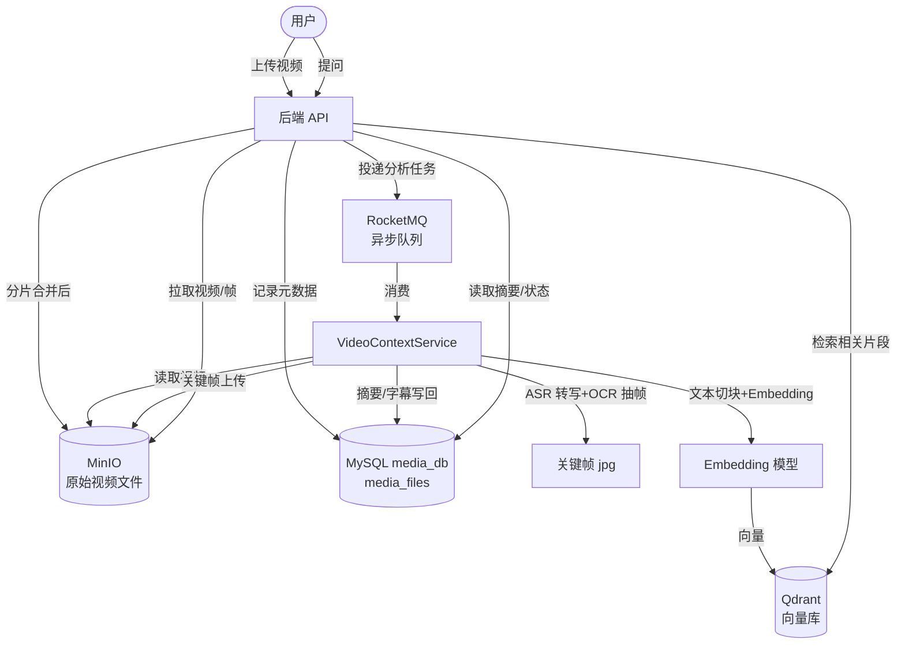
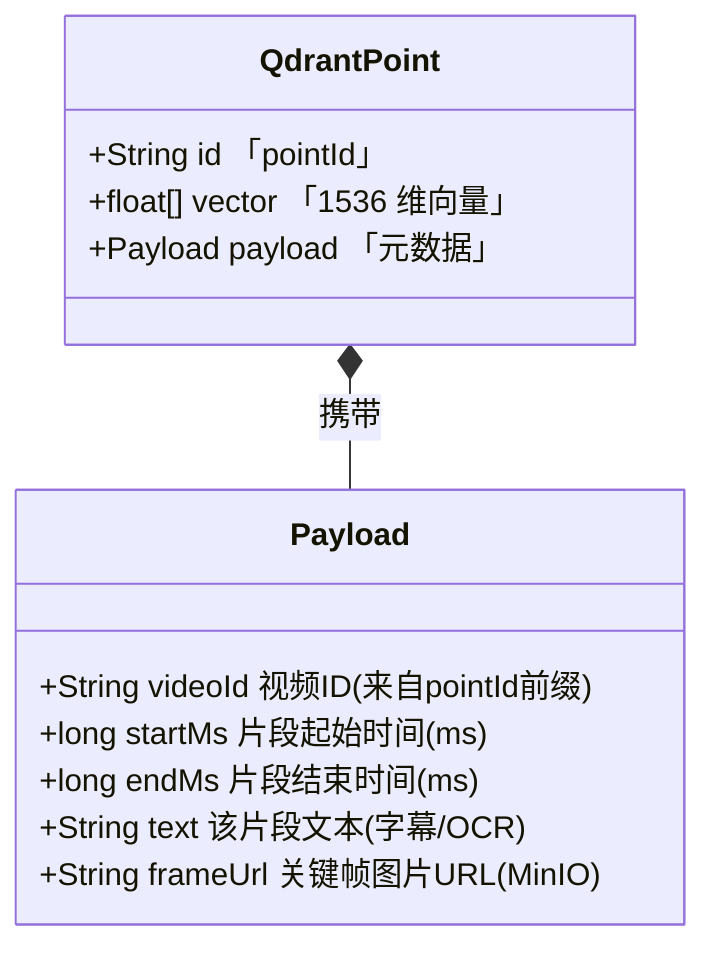
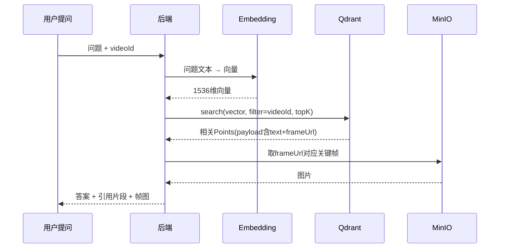
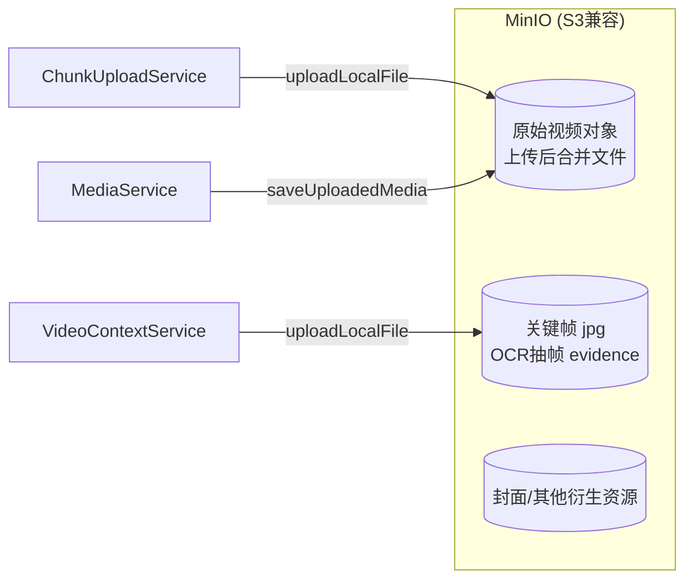

# VidMind-AI 存储架构详解（MySQL / Qdrant / MinIO）

> 本文档图形化说明 VidMind-AI 的三大存储组件：
> 1. **MySQL (media_db)** —— 业务关系型数据
> 2. **Qdrant** —— 视频语义向量的向量数据库
> 3. **MinIO** —— 视频/帧/封面的对象存储
>
> 同时补充说明 Redis（分片上传状态）与 RocketMQ（异步分析任务）的角色。

---

## 一、整体数据流与存储分工



---

## 二、MySQL 表结构（图形化 ER 图）

数据库 `media_db`，字符集 `utf8mb4`，引擎 `InnoDB`。共 **4 张表**：

```mermaid
erDiagram
    users ||--o{ media_files : "1:N 拥有"
    media_files ||--o{ agent_checkpoints : "1:N 检查点"
    media_files ||--o{ failed_analysis_tasks : "1:N 失败任务"

    users {
        BIGINT id PK "用户ID 自增"
        VARCHAR_32 username UK "登录名 唯一"
        VARCHAR_255 password "加密密码(接口屏蔽)"
        VARCHAR_50 nickname "昵称"
        VARCHAR_512 avatar "头像URL"
        VARCHAR_32 role "USER/ADMIN"
    }
    media_files {
        BIGINT id PK "媒体ID 自增"
        BIGINT user_id FK "所属用户"
        VARCHAR_255 filename "视频文件名"
        VARCHAR_32 status "COMPLETED等"
        VARCHAR_1024 file_path "MinIO对象URL"
        LONGTEXT ai_summary "AI整体摘要"
        LONGTEXT transcript_text "转写字幕全文"
        VARCHAR_1024 cover_url "封面图URL"
        TIMESTAMP upload_time "上传时间"
    }
    agent_checkpoints {
        BIGINT media_id PK_FK "媒体ID"
        VARCHAR_160 checkpoint_key PK "检查点名"
        VARCHAR_64 stage "阶段枚举"
        LONGTEXT payload "JSON中间状态"
        TIMESTAMP updated_at "更新时间"
    }
    failed_analysis_tasks {
        BIGINT id PK "自增"
        BIGINT media_id FK "媒体ID"
        VARCHAR_32 action "失败动作类型"
        VARCHAR_128 content_hash "内容MD5去重"
        VARCHAR_500 user_goal "用户目标"
        INT attempt_count "重试次数"
        VARCHAR_128 error_type "错误类型"
        VARCHAR_1000 error_message "错误详情"
        VARCHAR_32 status "默认FAILED"
        TIMESTAMP created_at "创建时间"
        TIMESTAMP updated_at "更新时间"
    }
```

### 各表字段明细

| 表名 | 字段 | 类型 | 约束 / 说明 |
|------|------|------|------|
| **users** | id | BIGINT | PK, 自增 |
| | username | VARCHAR(32) | 唯一索引 `uk_users_username` |
| | password | VARCHAR(255) | 加密存储，序列化时 `@JsonIgnore` |
| | nickname | VARCHAR(50) | 必填 |
| | avatar | VARCHAR(512) | 可空，头像 URL |
| | role | VARCHAR(32) | 默认 `USER` |
| **media_files** | id | BIGINT | PK, 自增 |
| | user_id | BIGINT | 索引 `(user_id, upload_time)` |
| | filename | VARCHAR(255) | 规范化文件名 |
| | status | VARCHAR(32) | 索引 `(status, upload_time)` |
| | file_path | VARCHAR(1024) | MinIO 对象 URL |
| | ai_summary | LONGTEXT | AI 整体摘要 |
| | transcript_text | LONGTEXT | 转写字幕全文 |
| | cover_url | VARCHAR(1024) | 封面图 URL |
| | upload_time | TIMESTAMP(3) | 默认当前时间 |
| **agent_checkpoints** | media_id | BIGINT | 联合 PK，FK→media_files |
| | checkpoint_key | VARCHAR(160) | 联合 PK，前缀删除 |
| | stage | VARCHAR(64) | 当前阶段 |
| | payload | LONGTEXT | JSON 中间状态 |
| | updated_at | TIMESTAMP(3) | 自动更新 |
| **failed_analysis_tasks** | id | BIGINT | PK, 自增 |
| | media_id | BIGINT | 索引 `(media_id)` |
| | action | VARCHAR(32) | 失败动作 |
| | content_hash | VARCHAR(128) | 去重 MD5 |
| | user_goal | VARCHAR(500) | 用户目标 |
| | attempt_count | INT | 重试计数 |
| | error_type | VARCHAR(128) | 错误类型 |
| | error_message | VARCHAR(1000) | 错误详情 |
| | status | VARCHAR(32) | 默认 `FAILED` |
| | created_at / updated_at | TIMESTAMP(3) | 时间戳 |

> 建表 SQL 见同目录 `mysql.sql`，由 `application.properties` 中 `spring.sql.init.mode=always` 在应用启动时自动执行。

---

## 三、Qdrant 向量数据库

Qdrant 是**向量数据库**，用于视频内容的语义检索（用户提问时召回相关片段）。

### 3.1 Collection（类比"表"）

项目中向量都存放在同一个 Collection 中（代码中 `COLLECTION_NAME` 常量），通过 `pointId` 的命名约定区分不同视频。

### 3.2 数据结构：Point（类比"行"）

Qdrant 中每个存储单元叫 **Point**，由三部分组成：



**Point 字段说明：**

| 组成部分 | 名称 | 类型 | 说明 |
|---------|------|------|------|
| 主键 | `id` (`pointId`) | String | 格式 `video_<videoId>_<seq>`，如 `video_123_00007` |
| 向量 | `vector` | `float[]` | **1536 维**（BGE-M3 等 Embedding 模型输出），相似度用 **Cosine** |
| 元数据 | `payload.videoId` | String | 视频 ID，便于按视频过滤 |
| 元数据 | `payload.startMs` | long | 片段起始毫秒 |
| 元数据 | `payload.endMs` | long | 片段结束毫秒 |
| 元数据 | `payload.text` | String | 该时间窗口内的文本（语音转写 + OCR 文字合并） |
| 元数据 | `payload.frameUrl` | String | 关键帧图片的 MinIO URL |

### 3.3 存储了什么数据

- **来源**：`VideoContext.build()` 把视频切成 60 秒窗口的 `VideoSegment`，每个 segment 合并「语音转写文本 + OCR 文字 + 关键帧 URL」。
- **切块**：`VideoChunk` 进一步把长文本切成 ≤512 字符、单段 ≤60s 的块，`EmbeddingUtils.toVector()` 调用模型生成向量。
- **写入**：`QdrantVectorStore.upsert()` 把每个 chunk 作为一个 Point 写入。
- **检索**：用户提问时 `searchByText()` 先对问题做 Embedding，再用 `filter` 按 `videoId` 过滤、Cosine 相似度 `topK` 召回最相关片段，连同 `frameUrl` 一起返回给大模型作答。



### 3.4 代码关键位置
- 集合定义 / 向量维度：`QdrantVectorStore.java`（`COLLECTION_NAME`、`VECTOR_SIZE=1536`、`Distance.COSINE`）
- 切块与向量化：`VideoChunk.java`、`EmbeddingUtils.toVector()`

---

## 四、MinIO 对象存储

MinIO 是 **S3 兼容的对象存储**，存视频文件本身和衍生图片。配置见 `MinioConfig` + `MinioUtils`。

### 4.1 存了什么（Bucket / 对象）



| 对象类型 | 来源 | 方法 | 在 MySQL 中的引用字段 |
|---------|------|------|------|
| 原始视频 | 分片上传合并后 | `ChunkUploadService.complete()` → `minioUtils.uploadLocalFile()` | `media_files.file_path` |
| 关键帧图片 | 抽帧 OCR 后 | `VideoContextService.extractKeyFrames()` → `minioUtils.uploadLocalFile()` | Qdrant `payload.frameUrl`（不进 MySQL） |
| 封面图 | 分析结果 | `minioUtils` | `media_files.cover_url` |

### 4.2 关键方法（`MinioUtils`）
- `uploadLocalFile(File, filename?)` —— 上传本地文件，返回可读 URL
- `upload(InputStream, ...)` —— 流式上传
- `download(...)` / `downloadTo(...)` —— 下载到本地（分析时读取视频用）
- `readableSource(path)` —— 返回可直接读取的源（本地文件原样返回，MinIO 路径下载到临时文件）

> 视频分析时，`VideoContextService.build()` 先 `readableSource(videoPath)` 把 MinIO 上的视频取回本地临时目录，再交给 ffmpeg 做 ASR/OCR。

### 4.3 部署参数（docker-compose）
- 镜像 `minio/minio`，端口 `9000`(API) / `9001`(控制台)
- 凭据来自环境变量 `MINIO_ROOT_USER` / `MINIO_ROOT_PASSWORD`
- 数据卷 `./minio/data`

---

## 五、其他存储组件（补充说明）

| 组件 | 角色 | 存什么 |
|------|------|--------|
| **Redis** | 分片上传状态 + 分布式锁 | `upload:chunked:<uploadId>`（Hash: filename/totalChunks/userId）、`:parts`（已传分片集合）、`:completed`（已完成 mediaId）；合并锁 `lock:upload:merge:<uploadId>` |
| **RocketMQ** | 异步分析任务队列 | 视频分析任务消息（解耦上传与 AI 分析） |

---

## 六、一句话总结

- **MySQL**：存"谁上传了什么视频、分析状态/摘要/字幕、断点、失败任务"——结构化业务数据。
- **Qdrant**：存"视频每段文本的 1536 维向量 + 时间戳 + 关键帧 URL"——语义检索，让用户问题能定位到视频具体片段。
- **MinIO**：存"视频文件本体和抽出来的关键帧图片"——大文件二进制存储。
- 三者通过 `media_files.id` ↔ `Qdrant payload.videoId` ↔ `MinIO URL` 串成完整链路。
